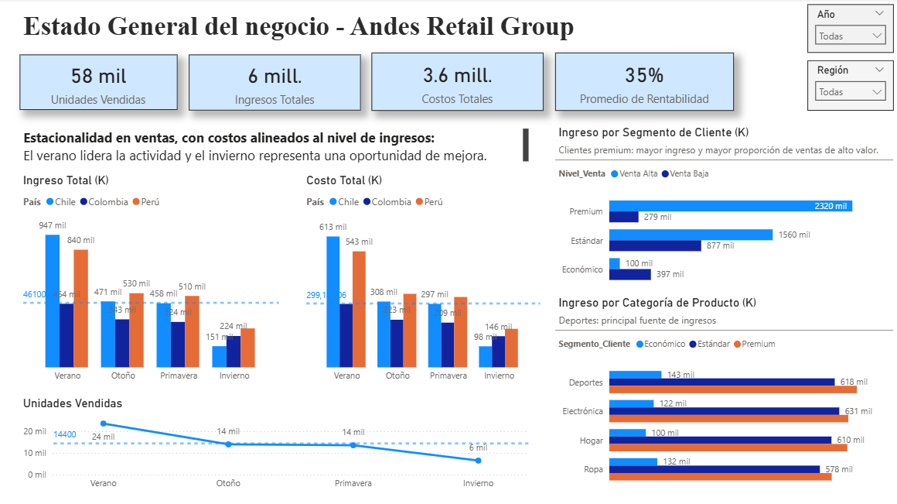
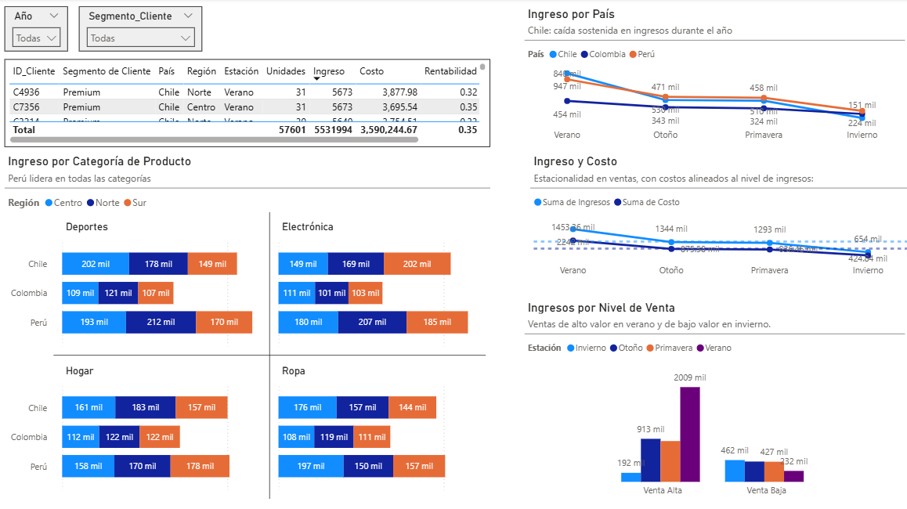

# Desempeño Comercial - Andes Retail Group

Andes Retail Group, una empresa de retail con operaciones en Perú, Chile y Colombia.

La empresa comercializa productos en cuatro categorías:

🖥️ Electrónica
👕 Ropa
⚽ Deportes
🏠 Hogar

La dirección ejecutiva necesita un dashboard interactivo que permita entender el desempeño comercial de los años 2024–2025.

## 💡 Preguntas del negocio
¿Cómo ha evolucionado el ingreso total entre 2024 y 2025?
¿Qué segmentos de clientes aportan mayor ingreso y rentabilidad?
¿Qué categorías de producto tienen mayor impacto en el negocio?
¿Existen diferencias relevantes entre países o regiones?
¿Qué patrones temporales se observan a lo largo del año?
¿Dónde podrían existir oportunidades de mejora comercial?

## 🛠️ Herramientas del proyecto
Power BI Desktop o Tableau
Visualizaciones nativas (barras, líneas, mapas, tarjetas KPI)
Modelo de narrativa SQCA

## 📖Narrativa del Dashboard (Modelo SCQA)
Se describe de forma estructurada la historia completa del dashboard usando SCQA, incluyendo contexto, problemas detectados, preguntas de negocio y recomendaciones basadas en datos.

### 🖥️ Vista General (Overview)

  

#### S (Situación):

Andes Retail Group opera en tres mercados principales (Perú, Chile y Colombia) con presencia en múltiples segmentos de clientes y categorías de productos. La empresa enfrenta dinámicas estacionales significativas, donde el desempeño varía considerablemente entre trimestres.

#### C (Complicación):

Aunque la empresa mantiene una rentabilidad del 35% (superior al promedio del retail) con 6 millones en ingresos totales, enfrenta un desafío estratégico: la estacionalidad extrema en demanda. Las unidades vendidas caen drásticamente de 24 mil en verano a solo 8 mil en invierno (reducción del 67%), lo que genera impactos significativos en el comportamiento de mercado:

Existe una marcada estacionalidad en las ventas, con mayor actividad en verano y una caída en invierno.
Ingresos y costos siguen un comportamiento similar, lo que indica una estructura de costos alineada al nivel de ventas.
Chile muestra una tendencia decreciente a lo largo del año.
El desempeño depende en gran medida de ciertos impulsores clave, como categorías (Deportes) y segmentos específicos (Premium).

#### Q (Pregunta):

¿Cómo está el negocio en general y cuáles son los principales factores que impulsan su desempeño?

#### A (Respuesta):

El negocio presenta un desempeño sólido con una dinámica claramente estacional, evidenciada por los siguientes factores clave:

Existe una marcada estacionalidad en las ventas, con mayor actividad en verano y una desaceleración en invierno, tanto en ingresos como en unidades vendidas.
Ingresos y costos evolucionan de manera similar a lo largo del año, lo que sugiere una estructura de costos alineada al nivel de actividad del negocio.
El segmento de clientes premium es el principal generador de ingresos, concentrando además la mayor proporción de ventas de alto valor.
La categoría de Deportes se posiciona como una de las principales fuentes de ingresos.
Se observan variaciones en el desempeño entre países, lo que refleja diferencias en la dinámica comercial según el mercado.
En conjunto, el negocio muestra solidez en generación de ingresos, pero con una alta dependencia de la estacionalidad y de segmentos y categorías específicas como principales impulsores del desempeño.

### 🔎 Vista Detalle

  

#### S (Situación):

Andes Retail Group opera en Chile, Colombia y Perú, generando ingresos a través de distintas categorías de producto, regiones y segmentos de clientes. El negocio presenta actividad a lo largo de todas las estaciones, con variaciones en ingresos, costos y volumen de ventas.

#### C (Complicación):

El análisis del desempeño evidencia comportamientos diferenciados:

Existe una variación estacional en los ingresos y unidades vendidas, con niveles más altos en verano y menores en invierno.
Ingresos y costos muestran una tendencia similar a lo largo de las estaciones, reflejando cambios en conjunto.
Se observa una caída sostenida de ingresos en Chile a lo largo del año.
La composición de ventas cambia por estación, con diferencias entre ventas de alto y bajo valor.

#### Q (Pregunta):

¿Cómo está evolucionando el negocio y qué variables explican sus variaciones en el tiempo?

#### A (Respuesta):

El desempeño del negocio está influenciado principalmente por factores estacionales, de segmento y de mercado:

Los ingresos y el volumen de ventas alcanzan su punto más alto en verano y disminuyen hacia invierno, evidenciando estacionalidad en la demanda.
Ingresos y costos evolucionan de forma similar, lo que indica un comportamiento alineado entre ambas variables.
Chile presenta una caída progresiva en ingresos a lo largo de las estaciones, a diferencia de los otros países.
Las ventas de alto valor son significativamente mayores en verano, mientras que en invierno predominan las ventas de menor valor.
Se observan diferencias en la distribución de ingresos por categoría, país y región, reflejando variabilidad en la participación comercial.
El negocio presenta una marcada estacionalidad, con variaciones en ingresos, tipo de ventas y desempeño por país. En este contexto, resulta clave comprender estas dinámicas para gestionar eficientemente los periodos de menor actividad, lo que hace necesario profundizar en el análisis de variables adicionales que aporten mayor visibilidad sobre el comportamiento del mercado.

